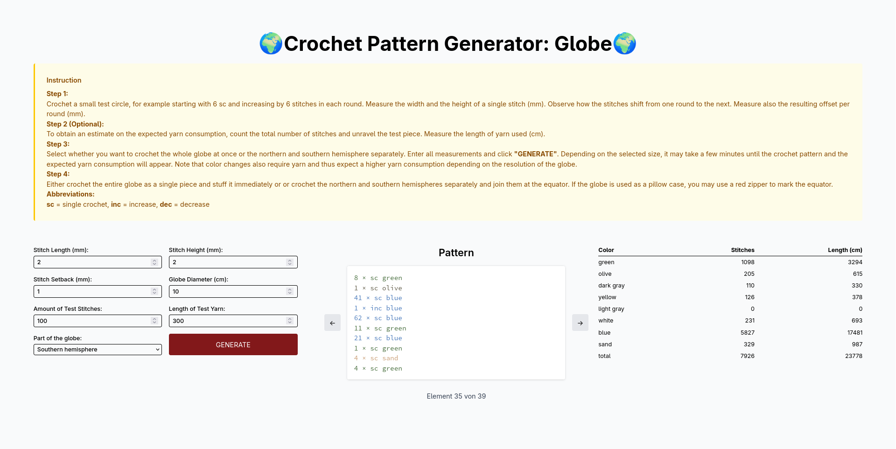
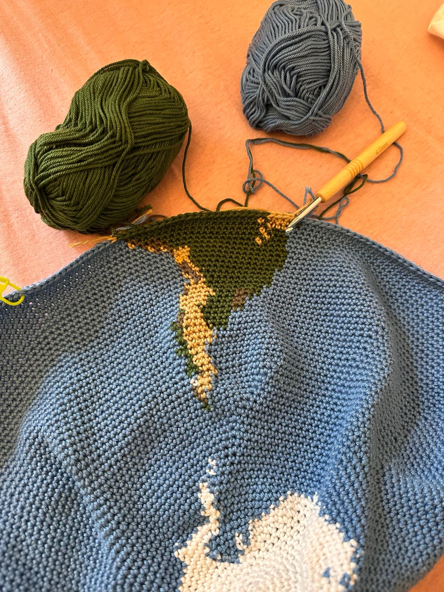

# Crochet Globe Generator

This tool generates a crochet pattern for a globe of any desired diameter and any type of stitch. 

## Usage

1. Crochet a small test circle, for example starting with 6 sc and increasing by 6 stitches in each round. Measure the width and the height of a single stitch (mm). Observe how the stitches shift from one round to the next. Measure also the resulting offset per round (mm).
2. To obtain an estimate on the expected yarn consumption, count the total number of stitches and unravel the test piece. Measure the length of yarn used (cm).
3. Select whether you want to crochet the whole globe at once or the northern and southern hemisphere separately. Enter all measurements and click **GENERATE**. Depending on the selected size, it may take a few minutes until the crochet pattern and the expected yarn consumption will appear. Note that color changes also require yarn and thus expect a higher yarn consumption depending on the resolution of the globe.
4. Either crochet the entire globe as a single piece and stuff it immediately or or crochet the northern and southern hemispheres separately and join them at the equator. If the globe is used as a pillow case, you may use a red zipper to mark the equator.

## Abbreviations

- `sc` = single crochet
- `inc` = increase
- `dec` = decrease

## Demo
Output:

Process of crocheting:

